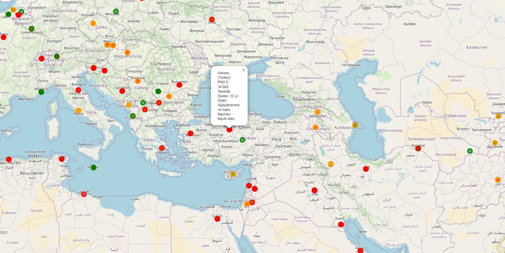

# **Hava Kirliliği ve Çevresel Faktörler İlişkisi: PM2.5 Analizi**

Bu proje, dünya genelindeki hava kirliliği seviyelerinin analizi ve bu seviyelerin düşürülmesi için öneriler geliştirmeyi hedefler.
Proje, PM2.5 (ince partikül madde) seviyelerinin tahmini, sıcaklık ve meteorolojik faktörlerin analizini kapsamaktadır.

### Haritanın Örnek Gösterimi

---

## **Proje Özeti**

- Çeşitli meteorolojik faktörler ile PM2.5 seviyelerinin ilişkisini inceleyen bir veri bilimi çalışması gerçekleştirilmiştir.
- Makine öğrenimi modelleri kullanılarak PM2.5 seviyelerinin tahmini yapılmıştır.
- PM2.5 seviyelerini düşürmek için bir temiz hava planı geliştirilmiştir.
- Veriler, zamansal ve mekânsal boyutlarda analiz edilerek görselleştirilmiştir.

---

## **Veri Setinin Genel Yapısı**

Veri seti, çeşitli meteorolojik değişkenleri ve hava kirliliği değerlerini içerir:

| **Sütun Adı**     | **Veri Sayısı (Non-Null)** | **Veri Tipi** |
| ----------------- | -------------------------- | ------------- |
| Latitude          | 10,000                     | Float         |
| Longitude         | 10,000                     | Float         |
| Temperature (°C)  | 10,000                     | Float         |
| Humidity (%)      | 10,000                     | Float         |
| Wind Speed (km/h) | 10,000                     | Float         |
| PM2.5 Levels      | 10,000                     | Float         |

### **Kayıp Değerler:**

Veri setinde eksik (null) veri bulunmamaktadır.

### **Bellek Kullanımı:**

Ortalama bellek kullanımı: ~15 MB.

---

## **Projede Kullanılan Yöntemler**

### **1. Veri Analizi**

- **Korelasyon Matrisi:** Meteorolojik değişkenler ve PM2.5 seviyeleri arasındaki ilişkileri gösterir.
- **Zamansal Analiz:** Ay bazında PM2.5 seviyelerinin değişimi incelenmiştir.
- **Scatter Plot:** Sıcaklık ve PM2.5 arasındaki ilişki görselleştirilmiştir.

### **2. Makine Öğrenimi ile PM2.5 Tahmini**

- **Model:** Random Forest Regressor
- **Performans Metriği:**
  - **R2 Skoru:** 0.99 (yüksek doğruluk)
  - **Mean Squared Error:** 20.03 (düşük hata)

### **3. Harita Görselleştirmeleri**

- PM2.5 seviyelerini harita üzerinde mekânsal olarak gösteren interaktif bir Folium haritası geliştirilmiştir.

---

## **Projenin Amacı**

Bu projenin amacı, PM2.5 seviyelerinin düşürülmesi için veri odaklı içgörüler sunmak ve politikalar oluşturulmasına katkıda bulunmaktır.
Ayrıca, hava kirliliği ile meteorolojik faktörlerin etkisini anlamak hedeflenmiştir.

---

## **Kullanılan Teknolojiler**

- **Python Kütüphaneleri:**
  - `pandas`, `numpy`, `seaborn`, `matplotlib`
  - `sklearn`, `folium`
- **Makine Öğrenimi:** Random Forest, GridSearchCV
- **Veri Kaynağı:** (https://www.kaggle.com/datasets/nelgiriyewithana/global-weather-repository)

---

## **Sonuçlar ve Öneriler**

1. PM2.5 seviyeleri sıcaklık faktörüyle güçlü ilişkiler göstermiştir.
2. Makine öğrenimi modeli ile yüksek doğrulukla PM2.5 tahmini yapılmıştır.
3. Harita görselleştirmesi ile kirli bölgeler kolayca tespit edilmiştir.
4. **Öneri:** Temiz hava projeleri öncelikli olarak nem oranı yüksek ve sıcaklık değişimlerinin fazla olduğu
   bölgelerde uygulanmalıdır.
